# Wayfare — design brief

A platform for planning a trip with the people you're going with. Mobile-first
web app, currently a working build with real write paths and an in-memory data
layer.

This document is the design handoff: what exists, why it looks the way it does,
and where it needs a designer's attention. Screenshots referenced below live in
`docs/screens/` and are captures of the running app, not drawings.

**Stack:** Next.js 15 (App Router), TypeScript, Tailwind CSS 3, `lucide-react`
icons, deployed to Netlify. Tokens live in `tailwind.config.ts` — the design
system is expressed as Tailwind theme extensions, so changes there propagate.

---

## 1. The idea behind the look

The visual language is a **boarding pass / ticket stub printed on kraft paper**.
Not "travel app with a photo of a beach" — the opposite. It borrows from the
things you actually accumulate on a trip: perforated tickets, till receipts,
barcode stubs, rubber-stamped forms.

Three consequences that should survive any redesign:

1. **It is a paper system, not a glass one.** Warm off-white surfaces, hairline
   tan borders, no glassmorphism, no gradients, minimal shadow.
2. **Monospace is load-bearing.** Anything with the character of a printed
   record — flight codes, times, references, money — is set in mono. This is the
   single strongest signal in the design; losing it collapses the whole idea.
3. **Sections are torn apart, not stacked.** The divider between every section
   is a perforation, so the page reads as one long ticket.

---

## 2. Tokens

Defined in `tailwind.config.ts`. Use the names, not the hex values, in any spec.

### Colour

| Token | Hex | Role |
|---|---|---|
| `ink` | `#12332E` | Deep pine. Hero background, bottom nav, headings. |
| `ink-soft` | `#1B453E` | Raised surfaces on ink. |
| `ink-text` | `#20241F` | Body text on paper. |
| `paper` | `#F3E9D2` | App background — the kraft ground. |
| `paper-hi` | `#FAF4E6` | Card surface, one step lighter than the ground. |
| `line` | `#DCCFAF` | Borders, dashed rules, perforations. |
| `muted` | `#6B6459` | Secondary text. |
| `lagoon` | `#1C7C8C` | Primary accent. |
| `lagoon-dark` | `#125866` | Primary buttons, active states. |
| `papaya` | `#FF7A45` | Secondary accent. Currently used only for highlights. |
| `stamp` | `#C2452D` | Alerts, errors, destructive actions. |
| `palm` | `#3F7D58` | Success, confirmed, packed. |

Semantic colour (`stamp` / `palm` / `papaya`) is deliberately separate from the
accent (`lagoon`), so status never competes with navigation.

The app is **single-theme light**. There is no dark mode and no theme toggle.
Deciding whether it needs one is an open question (§7).

### Type

| Role | Face | Used for |
|---|---|---|
| Display | **Fraunces** (variable, with `SOFT`/`WONK` axes) | Headings, route codes, prices, day numbers |
| Body | **IBM Plex Sans** (400/500/600/700) | Everything else |
| Mono | **IBM Plex Mono** (400/500/600) | Codes, times, references, figures, uppercase labels |

Loaded via `next/font/google`, self-hosted at build time.

The recurring small-label treatment ("overline") is: mono, 10px, uppercase,
`letter-spacing: 0.14em`, `muted`. It appears above nearly every figure and is
part of the system's texture.

### Shape and depth

| Token | Value | Use |
|---|---|---|
| `rounded-card` | 16px | Cards, inputs, buttons |
| `rounded-phone` | 22px | The device frame on desktop |
| `rounded-pill` | 20px | Pills, tabs, nav items |
| `shadow-card` | `0 1px 2px rgba(18,51,46,.06), 0 8px 24px -12px rgba(18,51,46,.18)` | Cards |
| `shadow-phone` | `0 24px 64px -24px rgba(18,51,46,.45)` | Device frame, hover lift |

Horizontal page padding is a consistent **20px** (`px-5`). Section headings sit
in that gutter; cards align to it.

---

## 3. The four signature patterns

These carry the identity. They're implemented once and shared, so they can't
drift — treat them as fixed points unless deliberately redesigning the system.

### Perforation divider
`components/shell/SectionDivider.tsx`, CSS in `app/globals.css` (`.perf`).

A 2px dashed rule in `line`, with an 18px circle straddling each end — filled
with the page ground and ringed in `line`, so it reads as a notch punched
through the paper. A vertical variant (`.perf-v`) splits the boarding pass from
its stub.

Used between every section, inside the stay card, inside the receipt, and across
each row of the trips list.

### Boarding pass
`components/trip/BoardingPassList.tsx` — see `docs/screens/05-flights.png`.

Two-part card. Left: airline, route codes in display face at 24px, departure /
arrival / seats in a three-column mono grid. Right: a 76px stub holding the
flight number, a CSS barcode, and the booking reference. Split by a vertical
perforation.

### Receipt
`components/trip/BudgetReceipt.tsx` — see `docs/screens/06-budget.png`.

Ruled paper at a **28px pitch**, with expense rows set to exactly `h-7` so each
figure sits *on* a rule rather than being struck through by it. Leader dots run
between label and amount. All figures are mono with `tabular-nums`.

### Sticky shortcut bar
`components/shell/ShortcutNav.tsx` — visible in every trip screenshot.

Six slots (Trip / Stay / Flights / Plan / Budget / Info) on an `ink` bar, with
scroll-spy driven by one `IntersectionObserver` over the sections that carry
ids. Active slot gets a `lagoon-dark` pill.

---

## 4. Screens

### The list
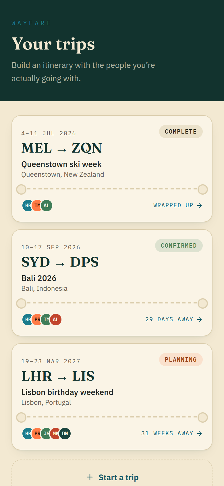

Every trip the user belongs to. The **route code is the trip's identity** — it's
what you recognise before the name. Status pill top-right, member initials
bottom-left, countdown bottom-right. Perforation across the middle of each card.

### Inside a trip

| | |
|---|---|
| 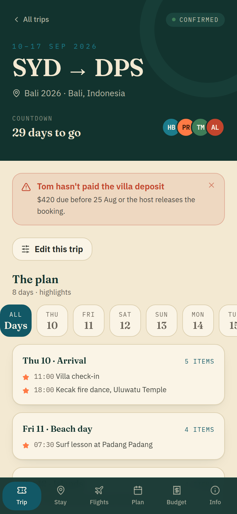 | 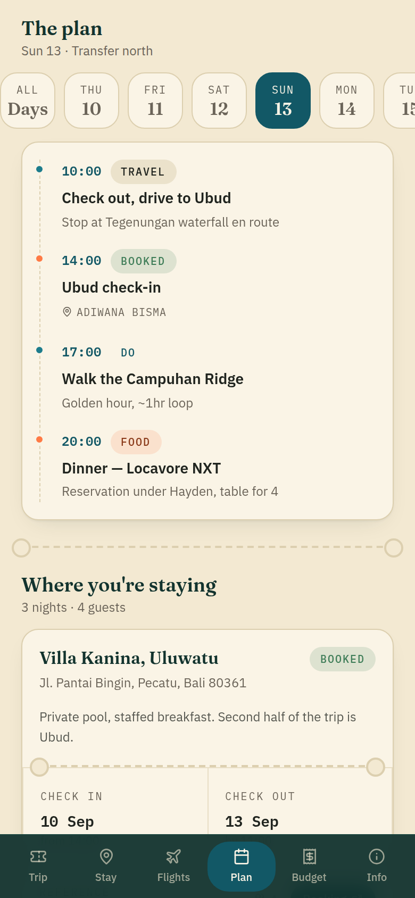 |
| **Hero + plan.** Route code at 40px, dates as a mono eyebrow, countdown, group avatars, then an alert strip and the day tabs. | **A selected day.** Tabs filter the timeline. Dashed spine with nodes — papaya for highlights, lagoon otherwise. |
| 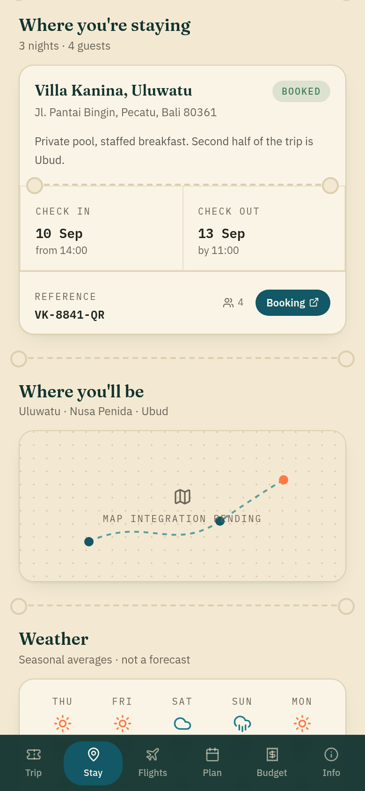 | 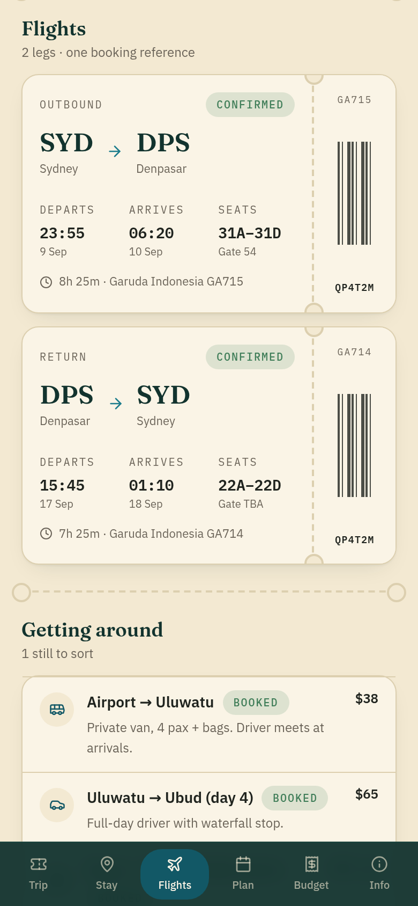 |
| **Accommodation.** Torn across the middle; check-in / check-out either side of the perforation. | **Boarding passes.** One per leg. |
| 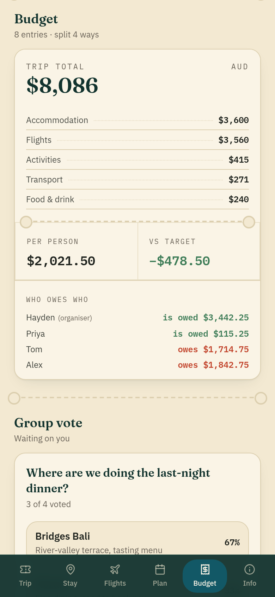 | 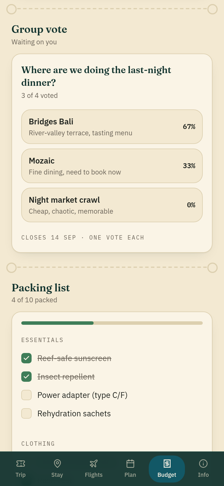 |
| **The receipt.** Category rows, per-person and vs-target split cells, then a "who owes who" ledger. | **Vote and packing.** Poll options with a result bar behind the label; packing list with a progress rail. |
| 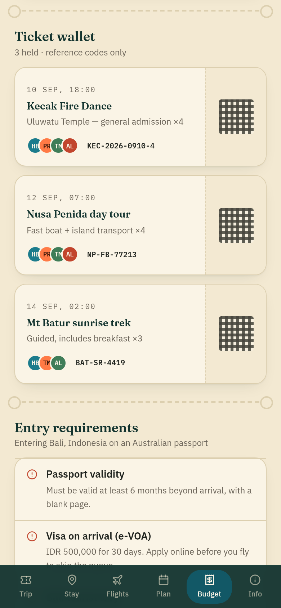 | 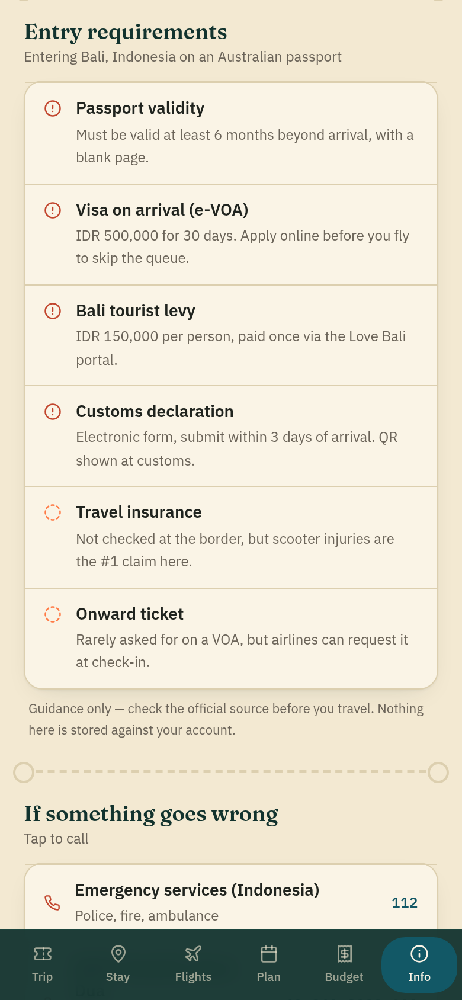 |
| **Ticket wallet.** Reference codes with a decorative CSS QR block. | **Entry requirements + emergency contacts.** Reference content, tap-to-call. |

Full section order on the trip page: hero → alerts → edit link → plan → stay →
map → weather → flights → transport → budget → vote → packing → wallet → entry
requirements → emergency → activity feed → share / add-to-calendar.

### Building one

| | |
|---|---|
| 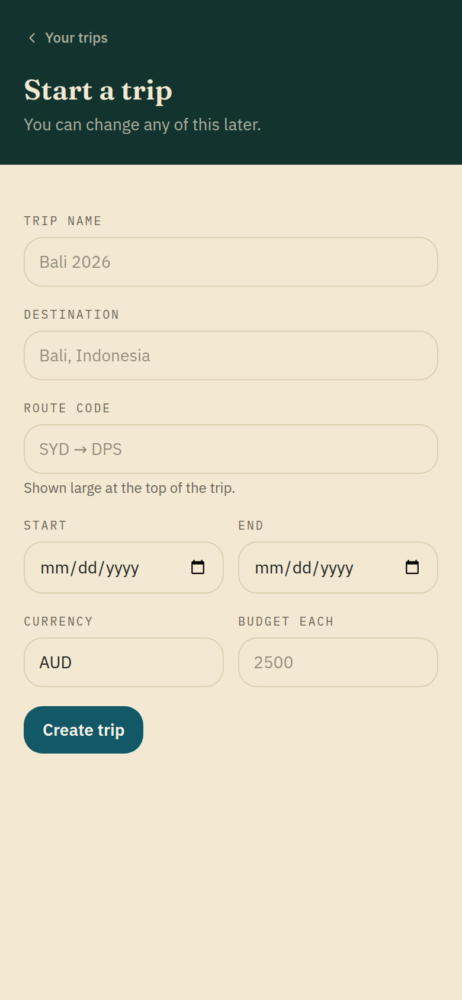 | 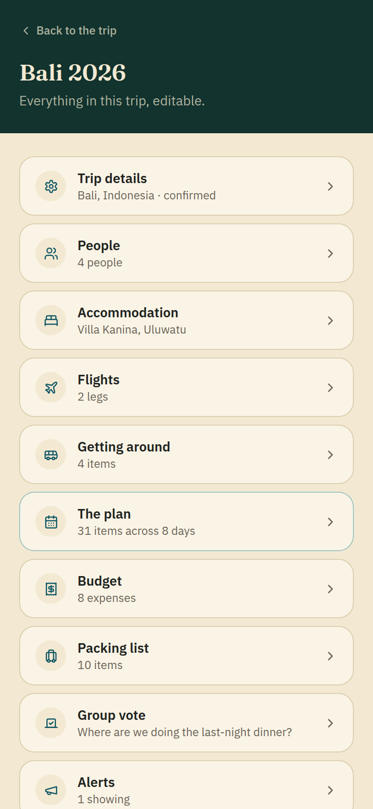 |
| **Create.** Seven fields. Days are derived from the date range. | **Hub.** Ten section editors, each showing what's already in it. |
| 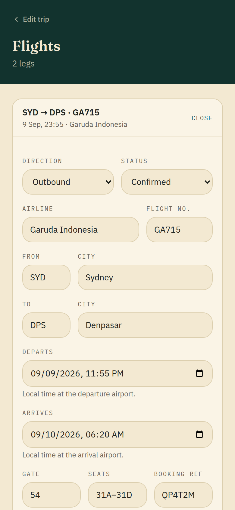 | 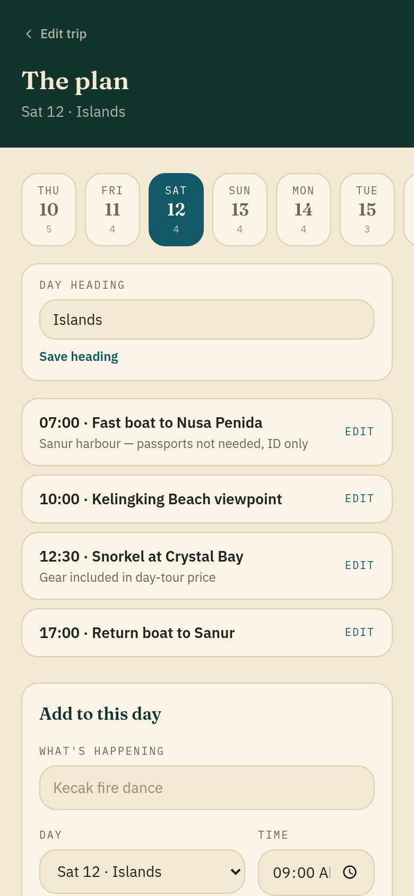 |
| **List editor.** Existing rows collapsed in `<details>`; the add form is the same component as the edit form. | **Plan editor.** One day at a time, chosen by query param. |
| 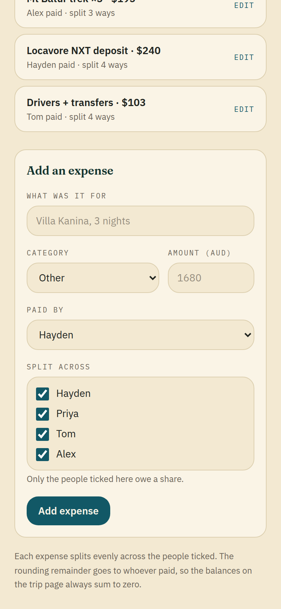 | 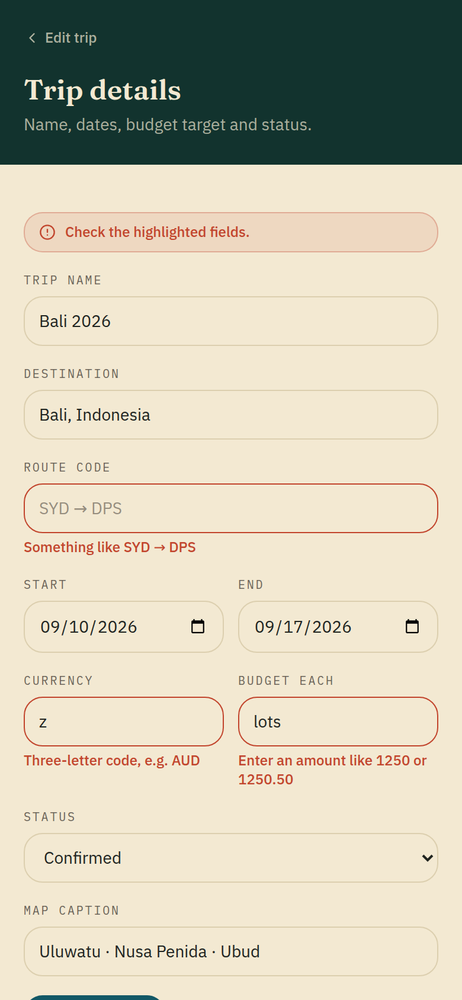 |
| **Expense.** Split checkboxes decide who owes a share. | **Errors.** Server-side, per field, with typed values preserved. |

### The edges

| | |
|---|---|
| 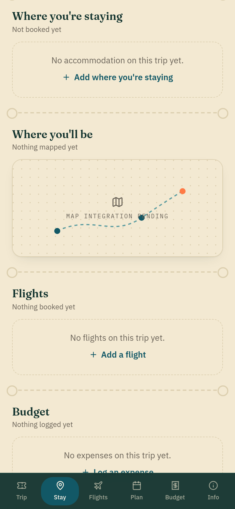 | **A trip with nothing in it.** Every section has an empty state that names the gap and links to the editor that fills it. A new trip is nothing *but* these, so they matter more than usual. |

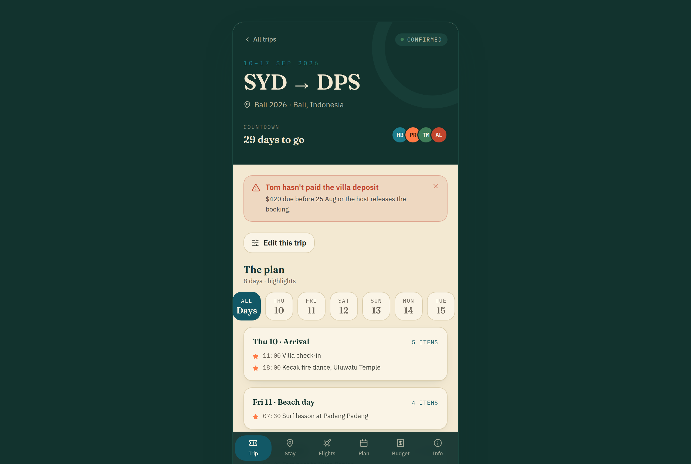

**Desktop** is currently the mobile layout in a 420px device frame on an `ink`
backdrop. See §7 — this is the biggest open question.

---

## 5. Voice

Plain, specific, slightly dry. Written from the traveller's side of the screen.

- "Where you're staying", not "Accommodation management"
- "Waiting on you" / "Your vote is in", not "Poll status: incomplete"
- "Nothing planned for this day." — states the fact, offers the action, no apology
- Errors say what to do: "Three-letter code, e.g. AUD", "End date can't be
  before the start date"
- Placeholders admit what they are: the weather strip is labelled "Seasonal
  averages · not a forecast"; the map says "Map integration pending"

Sentence case throughout except mono labels, which are uppercase.

---

## 6. Hard constraints

- **No personal document uploads.** No passports, insurance, or boarding-pass
  files — no upload UI anywhere, no storage, no PII at rest. The ticket wallet
  holds reference codes typed in by the organiser. Any design that implies
  uploading a document is out of scope.
- **Mobile-first.** 390px is the design width. Everything must work edge-to-edge
  on a phone.
- **Multi-tenant.** Any user creates trips and invites members; nothing is
  hardcoded to one trip. Every read view has an editor behind it.
- **Icons are Lucide.** No emoji in the UI.
- **Tailwind tokens only.** No one-off hex values in components.

---

## 7. Open design questions

This is where a design pass would add most.

1. **Desktop is unresolved.** Right now it's a phone in a frame. Options: keep
   it as a deliberate stylistic choice; build a genuine two-column layout
   (itinerary left, day detail right); or make the frame a real "device on a
   desk" presentation. Needs a decision before it grows.

2. **The trip page is one very long scroll** — around fifteen sections. The
   shortcut bar has six slots, so sections without an anchor leave the active
   state stale as you scroll past them. Does this need real segmentation
   (tabs, an accordion, sub-pages) or is the long scroll the right call for a
   document you skim on a phone?

3. **The editors don't carry the identity.** Read views are ticket stubs;
   editors are plain forms on the same paper. Functional but flat. They could
   pick up the perforation and mono-label language without becoming precious.

4. **Rhythm is uniform.** Nearly every section is "heading, then card on paper".
   No variation in density or scale across a long page. Some sections probably
   deserve to be quieter and one or two louder.

5. **`papaya` is underused.** It's a full accent that currently only tints
   highlight dots and one status pill. Either give it a real job or drop it.

6. **Placeholders needing real design:** the trip map (currently a blueprint
   sketch), the weather strip (thin — does it earn its place?), the barcode and
   QR blocks (CSS gradients; real codes may not be available for every vendor).

7. **Missing states:** no loading or skeleton treatment, no error page beyond
   404, no offline state — relevant for something you'd open at an airport.

8. **Dark mode?** Currently light-only. A trip app gets used at 2am in a taxi.
   The `ink` palette already exists as a dark surface, so the groundwork is
   there if it's wanted.

9. **Two contrast problems, measured.**
   - `stamp` on `paper` is **4.16:1** — below the 4.5:1 AA floor for normal
     text. That's the colour used for field-level error messages at 12px, so
     the least readable text in the app is the text that matters most when
     something has gone wrong. Needs a darker `stamp`, or a dedicated
     error-text token.
   - `muted` on `paper` is **4.84:1** — passes, but it's the colour used for the
     10px uppercase mono labels, where the small size and letter-spacing make it
     read thinner than the number suggests. Worth a deliberate call.

   For reference, the rest is comfortable: `ink-text` on `paper` is 13.05:1, and
   `lagoon-dark` on `paper-hi` is 7.33:1.

---

## 8. Where things live

```
tailwind.config.ts          Tokens — colour, type, radius, shadow
app/globals.css             .perf, .perf-v, .receipt-rules, .barcode, .qr-block
components/shell/           PhoneFrame, Card/Pill/Overline/EmptyState,
                            SectionDivider, ShortcutNav
components/trip/            One component per itinerary section
components/edit/            Editor shell + one form per entity
components/form/            Field primitives, submit and delete buttons
docs/screens/               The screenshots referenced above
```

Live gallery of every screen:
<https://claude.ai/code/artifact/49005563-e820-47e2-81af-4189770f0e45>
